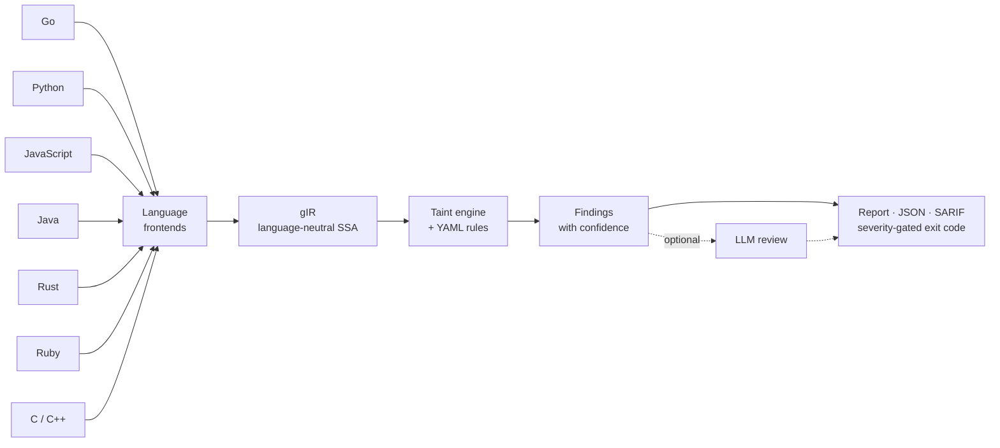
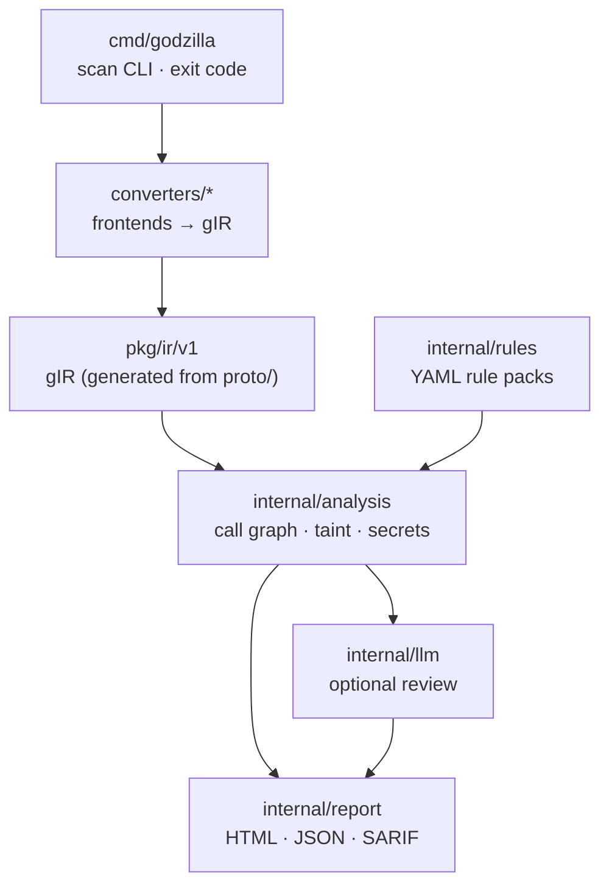

# Godzilla

A fast, multi-language **Static Application Security Testing (SAST)** analyzer for CI/CD gates.

Godzilla lowers source code from several languages into one language-neutral SSA
intermediate representation — **gIR** — and runs a single inter-procedural taint
engine over it. Every language funnels into the same IR, so you **write a
detection rule once and it applies across every supported language**.



<sub>All seven languages lower to the same gIR; a single engine and rule set run over it.</sub>

> Status: usable and tested, but young. See [Status & limitations](#status--limitations).

## Features

- **Multi-language, one engine.** Go, Python, JavaScript (incl. Vue/Svelte SFCs),
  Java, Rust, and Ruby (plus C/C++ in an opt-in cgo build) all emit the same gIR;
  the taint engine and rules are language-agnostic.
- **Inter-procedural taint tracking.** Follows untrusted data across function
  calls (source → sanitizer → sink). Each finding carries a **confidence** — High
  for intra-procedural, Medium for cross-function.
- **YAML rules, sink-argument aware.** Sources / sinks / sanitizers / propagators
  are canonical-name globs. A sink can pin its injection-point argument
  (`"go:*database/sql*.Query#0"`), so a parameterized `db.Query("... = ?", x)` is
  **not** a false positive. See [docs/writing-rules.md](docs/writing-rules.md).
- **Batteries included.** Built-in packs for SQL injection, command injection,
  path traversal, SSRF, XSS, open redirect, insecure deserialization, and code
  injection, plus non-dataflow checks for **weak crypto** and **hardcoded
  secrets**.
- **CI-friendly output.** Human-readable findings, a self-contained **HTML
  report**, **JSON** and **SARIF 2.1.0** (for GitHub code scanning), and a
  severity-gated **exit code**.
- **Optional LLM review.** A pluggable stage sends low-confidence findings to
  Claude to trim false positives; it fails open and is off by default.
- **Single self-contained binary.** Go/JS/Ruby-parsing is pure Go; Python, Java,
  and Rust shell out to a toolchain on `PATH` and degrade gracefully when absent.

## Install

```bash
go install godzilla/cmd/godzilla@latest    # or, from a clone:
go build -o godzilla ./cmd/godzilla
```

Requires **Go 1.25+**. Scanning Python, Ruby, Java, or Rust also needs that
language's toolchain (`python3`, `ruby`, a JDK 24+ `java`, `rustc`) on `PATH`;
each degrades gracefully when absent. Or skip install entirely and
[run with Docker](#run-with-docker).

## Quick start

```bash
# Scan a directory (or a single source file) with the built-in rules
godzilla scan ./path/to/project

# Write an HTML report and fail the build only on high+ severity
godzilla scan --html report.html --fail-on high ./path/to/project

# Machine-readable output: JSON for tooling, SARIF for GitHub code scanning
godzilla scan --sarif results.sarif --json results.json ./path/to/project

# Add your own rules on top of the built-ins, and print the gIR summary
godzilla scan --rules myrules.yaml --summary ./path/to/project

# Triage lower-confidence findings with an LLM (needs ANTHROPIC_API_KEY)
godzilla scan --llm-review ./path/to/project

# Changed-files mode: gate only what a commit touched (one process, one gate)
git diff --name-only --cached | godzilla scan -files -
```

**Pre-commit hook** (`.git/hooks/pre-commit`) — gate a commit on only its staged
files, so a docs-only commit passes cleanly:

```bash
#!/bin/sh
git diff --name-only --cached --diff-filter=d | godzilla scan -files - --fail-on high
```

**Exit codes:** `0` clean · `1` error · `2` bad usage · `3` findings at/above
`--fail-on` (default: `medium`). Use the exit code as your CI gate.

```
$ godzilla scan ./test/go/sql_injection
[high] go-sql-injection (CWE-89, confidence: high)
  Untrusted input flows into a database/sql query without parameterized arguments...
  sink:   .../main.go:62:24  ->  go:(*database/sql.DB).Query
  source: .../main.go:59:26
  in:     go:.../sql_injection.main$1
1 finding(s); 1 at/above "medium".
```

## Run with Docker

Prebuilt images ship with the toolchains a scan needs, so you can gate a repo
without installing anything. They live on GHCR in two variants:

| Image | Size | Scans |
|---|---|---|
| `ghcr.io/bytevet/godzilla` (`:latest`) | ~600–700 MB | Go · JavaScript/TS · Python · Ruby · secrets |
| `ghcr.io/bytevet/godzilla:full` | ~1.5–2 GB | everything in slim **+ Java + Rust** |

The entrypoint is `godzilla` and the default command is `scan .`, so mounting a
repo at `/src` scans it immediately:

```bash
# Scan the current directory (exit 3 on a finding at/above --fail-on)
docker run --rm -v "$PWD:/src" ghcr.io/bytevet/godzilla

# Any arguments override the default `scan .`
docker run --rm -v "$PWD:/src" ghcr.io/bytevet/godzilla \
  scan --sarif /src/results.sarif --fail-on high /src

# Java/Rust need the full image
docker run --rm -v "$PWD:/src" ghcr.io/bytevet/godzilla:full
```

The slim image **skips** Java and Rust with a coverage warning rather than
failing. Tags: `X.Y.Z`/`X.Y`/`latest` (slim) and `X.Y.Z-full`/`full` (full) track
releases; `edge`/`edge-full` track `main`. Images are multi-arch (amd64 + arm64).

## Supported languages & detections

| | Go | Python | JavaScript | Java | Rust | Ruby |
|---|---|---|---|---|---|---|
| Parser | `golang.org/x/tools` SSA | `python3` `ast` | goja (pure Go); TS/JSX/ESM via esbuild; `.vue`/`.svelte` SFCs | JVM bytecode (`java.lang.classfile`) | rustc MIR | `ruby` Ripper |
| SQL injection | ✅ | ✅ | ✅ | ✅ | ✅ | ✅ |
| Command injection | ✅ | ✅ | ✅ | ✅ | ✅ | ✅ |
| Path traversal | ✅ | ✅ | ✅ | ✅ | ✅ | — |
| SSRF | ✅ | ✅ | ✅ | ✅ | ✅ | — |
| Reflected XSS | ✅ | ✅ | ✅ | ✅ | ✅ | — |
| Open redirect | ✅ | ✅ | ✅ | ✅ | ✅ | — |
| Insecure deserialization | — | ✅ | — | ✅ | — | — |
| Code injection (`eval`) | — | ✅ | ✅ | — | — | — |
| Weak crypto | ✅ | — | — | ✅ | — | — |

> **Hardcoded secrets** (CWE-798) are detected in **all** languages by a regex
> scan over gIR string constants, independent of the taint engine.

- **JavaScript** also scans **Vue** (`.vue`) and **Svelte** (`.svelte`)
  single-file components: untrusted data reaching `v-html`/`:href` or `{@html}` is
  flagged as template-injection XSS (CWE-79). Pure Go, no Node.
- **Java** analyzes JVM **bytecode** (so it scans `.class`/`.jar` too); needs a
  JDK 24+ `java` on `PATH`. Maven/Gradle projects are built first so third-party
  deps are on the classpath.
- **Rust** analyzes **rustc MIR** and ships in the default binary — only `rustc`
  is needed. A `Cargo.toml` project is built so web-framework request accessors
  are recognized as sources.
- **C / C++** are analyzed via **LLVM IR** — an opt-in **cgo** build
  (`make build-llvm`, needs libLLVM + clang), *not* in the default binary. Adds
  command injection, path traversal, format string, SQL injection, and
  buffer-overflow checks.

Full frontend details are in [ARCHITECTURE.md](ARCHITECTURE.md).

## Writing rules

A rule is a source→sink taint spec (or a non-dataflow `dangerous-call` check)
matched against canonical `<lang>:module.Type.member` names. Adding a detection is
usually a few lines of YAML in [`rulepacks/`](rulepacks); pass your own with
`--rules`. See the **[rule-authoring guide](docs/writing-rules.md)**.

## How it works

- **gIR** (`proto/` → `pkg/ir/v1/`) is a small language-neutral SSA core plus an
  `INTRINSIC` escape hatch, with stable canonical names so rules join across languages.
- **Frontends** (`converters/*`) lower each language to gIR.
- **Analysis** (`internal/analysis/`) builds a call graph and runs inter-procedural
  taint, plus the secrets scan.
- **Rules**, **report**, **LLM reviewer**, and the **CLI** sit on top.



See [ARCHITECTURE.md](ARCHITECTURE.md) for the full design and rationale.

## Status & limitations

Godzilla is functional and covered by tests, but deliberately scoped:

- **Python/JS lowering is straight-line** — control flow is flattened into one
  conceptual pass. Taint still flows through the common expression forms and
  class-based handlers; the main gap is taint carried across methods via instance
  attributes (`self.attr` / `this.attr`).
- **Taint is inter-procedural but context-insensitive.** Interface/dynamic
  dispatch is threaded via class-hierarchy analysis (an over-approximation).
- **SSRF is host-aware** — a finding is suppressed when the taint only reaches the
  path/query of a *proven* fixed host, conservatively (never a false negative).
- **Pointer analysis is approximated** (value-flow + CHA), not full points-to.

See the [implementation status](ARCHITECTURE.md#implementation-status) for the
per-component detail.

## Quality gate

Every PR is measured against its base on four axes — LOC changed (excluding
tests), corpus TP/FP/FN, rule churn, and scan performance — by
`scripts/pr-quality-gate.sh`, wired into CI so the report is posted as a PR
comment and precision/recall/perf regressions block the merge. Run it yourself
with `scripts/pr-quality-gate.sh origin/main`. See
[docs/quality-gate.md](docs/quality-gate.md).

## Contributing

Contributions welcome — see [CONTRIBUTING.md](CONTRIBUTING.md). Good first areas:
new built-in rules (often just YAML — [guide](docs/writing-rules.md)), a new
language frontend, or improving frontend fidelity.

## License

[MIT](LICENSE) © 2026 SYM01
