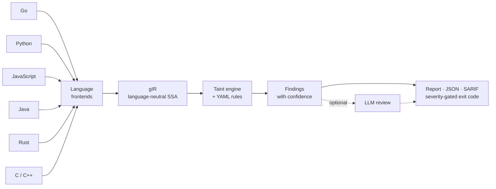
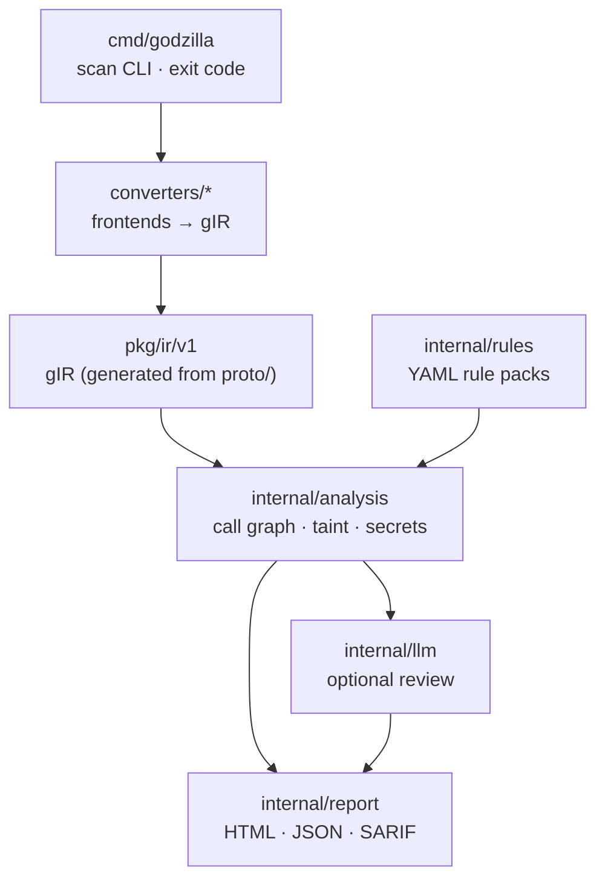

# Godzilla

A fast, multi-language **Static Application Security Testing (SAST)** analyzer for CI/CD gates.

Godzilla lowers source code from several languages into one language-neutral SSA
intermediate representation — **gIR** — and runs a single inter-procedural taint
engine over it. Every language funnels into the same IR, so you **write a
detection rule once and it applies across every supported language**.



<sub>All six languages lower to the same gIR; a single engine and rule set run over it.</sub>

> Status: usable and tested, but young. See [Status & limitations](#status--limitations).

## Features

- **Multi-language, one engine.** Go, Python, JavaScript, Java, and Rust frontends
  (plus C/C++ in the opt-in cgo build) all emit the same gIR; the taint engine and
  rules are language-agnostic.
- **Inter-procedural taint tracking.** Follows untrusted data across function
  calls (source → sanitizer → sink) with a call graph and function summaries.
  Each finding carries a **confidence** (High for intra-procedural, Medium for
  cross-function).
- **YAML rules, sink-argument aware.** Sources / sinks / sanitizers / propagators
  are canonical-name globs. Sinks can pin the exact injection-point argument
  (`"go:*database/sql*.Query#0"`), so a parameterized query
  `db.Query("... = ?", userInput)` is **not** a false positive.
- **Built-in rule packs** for SQL injection, command injection, path traversal,
  SSRF, reflected XSS, open redirect, insecure deserialization (Python), and
  code injection (JS `eval`), plus a regex-based **hardcoded-secrets** scanner.
- **CI-friendly.** Human-readable findings, a self-contained **HTML report**,
  **JSON** and **SARIF 2.1.0** output (for GitHub code scanning / custom tooling),
  and a severity-gated **exit code**.
- **Optional LLM review.** A pluggable stage sends low-confidence findings to
  Claude to trim false positives; it fails open and is off by default.
- **Single self-contained binary.** The Go and JavaScript frontends are pure Go;
  Python, Java, and Rust shell out to the toolchain already on `PATH` (`python3`,
  a JDK `java`, `rustc`) and degrade gracefully when it is absent. C/C++ is an
  opt-in cgo build (libLLVM). No frontend adds a runtime dependency to *run* the
  binary — only to analyze that language.

## Install

```bash
go install godzilla/cmd/godzilla@latest    # or, from a clone:
go build -o godzilla ./cmd/godzilla
```

Requires **Go 1.25+**. Scanning Python prefers a `python3` on `PATH`.

## Quick start

```bash
# Scan a directory (or a single .go/.py/.js file) with the built-in rules
godzilla scan ./path/to/project

# Write an HTML report and fail the build only on high+ severity
godzilla scan --html report.html --fail-on high ./path/to/project

# Machine-readable output: JSON for tooling, SARIF for GitHub code scanning
godzilla scan --sarif results.sarif --json results.json ./path/to/project

# Add your own rules on top of the built-ins, and print the gIR summary
godzilla scan --rules myrules.yaml --summary ./path/to/project

# Triage lower-confidence findings with an LLM (needs ANTHROPIC_API_KEY)
godzilla scan --llm-review ./path/to/project
```

**Exit codes:** `0` clean · `1` error · `2` bad usage · `3` findings at/above
`--fail-on` (default: `medium`). Use the exit code as your CI gate.

### Example

```
$ godzilla scan ./test/go/sql_injection
[high] go-sql-injection (CWE-89, confidence: high)
  Untrusted input flows into a database/sql query without parameterized arguments...
  sink:   .../main.go:62:24  ->  go:(*database/sql.DB).Query
  source: .../main.go:59:26
  in:     go:.../sql_injection.main$1
1 finding(s); 1 at/above "medium".
```

## Supported languages & detections

| | Go | Python | JavaScript | Java | Rust |
|---|---|---|---|---|---|
| Parser | `golang.org/x/tools` SSA | `python3` `ast` | goja (pure Go) | JVM bytecode (`java.lang.classfile`) | rustc MIR |
| SQL injection | ✅ | ✅ | ✅ | ✅ | ✅ |
| Command injection | ✅ | ✅ | ✅ | ✅ | ✅ |
| Path traversal | ✅ | ✅ | ✅ | — | ✅ |
| SSRF | ✅ | ✅ | ✅ | — | ✅ |
| Reflected XSS | ✅ | ✅ | ✅ | — | — |
| Open redirect | ✅ | ✅ | ✅ | — | — |
| Insecure deserialization | — | ✅ | — | — | — |
| Code injection (`eval`) | — | — | ✅ | — | — |

> **Hardcoded secrets** (CWE-798) are detected in **all** languages by a regex
> scan over gIR string constants — independent of the taint engine.

Notes on the compiled languages:

**Java** is analyzed at the JVM-bytecode level: an embedded single-file helper
(`java JavaDump.java`) compiles `.java` sources in-process and reads `.class`
files with the standard `java.lang.classfile` API, and Godzilla simulates the
operand stack to recover SSA values. Needs a **JDK 24+** `java` on `PATH`;
sources that require a classpath are best scanned as compiled `.class`/`.jar`.

**Rust** is analyzed via **rustc MIR** (Mid-level IR), in the **default pure-Go
binary** — only `rustc` is needed at scan time (like Python needs `python3`).
Godzilla runs `rustc --emit=mir` and lowers the textual MIR with a straight-line
value-forwarding pass. MIR, unlike Rust's LLVM IR, names the source-level public
API (`std::env::var`, `Command::arg` — not the internal, version-unstable
`std::env::__var`) and assigns call results directly to locals (no `sret`
out-pointer indirection), so command injection and path traversal are detected
today, with taint flowing through `format!`. Emitting MIR skips codegen, so it is
fast (~40 ms/file). A scan target with a `Cargo.toml` is built with `cargo` so a
**web-framework** dependency resolves and its request accessors (an untrusted
HTTP query param / header / body) are recognized as taint sources — the real
attack surface. Samples that pull an external crate over the network are opt-in
(`GODZILLA_RUST_E2E=1`), like Java's Spring build sample.

**C / C++** are analyzed via **LLVM IR**: clang compiles each unit to IR
(`-O1 -g`), parsed with libLLVM and lowered to gIR. This is an opt-in **cgo**
build — `make build-llvm` (or `go build -tags "llvm byollvm"` with libLLVM CGO
flags) — *not* in the default binary, which ships a stub for C/C++. Needs libLLVM
+ clang. Command injection (`system`/`popen`/`exec*`), path traversal
(`fopen`/`open`), and format-string (`printf`-family) are detected; taint flows
through primitive (`char*`) values. C++ code that routes untrusted data through
heap aggregates (`std::string`) is not yet tracked.

## Writing rules

A rule is a source→sink taint spec matched against canonical fully-qualified
names (`<lang>:module/path.Type.Member`). Globs use `*` (matches across `/` and
`.`); a sink may append `#<argIndex>` to restrict the injection point to a
specific (receiver-excluded) argument.

```yaml
rules:
  - id: my-sql-injection
    languages: [go]
    severity: high
    cwe: CWE-89
    message: Untrusted input reaches a SQL query.
    sources:
      - "go:*net/http*.Request*.FormValue"
      - "go:*net/url*.Get"
    sinks:
      - "go:*database/sql*.Query#0"        # only the query string; bound params are safe
      - "go:*database/sql*.QueryContext#1" # ctx is arg 0, query is arg 1
    sanitizers: []
    propagators:
      - "go:fmt.Sprintf"
      - "go:strings.Join"
```

Pass a file with `--rules`; it is merged with the built-in packs (see the
top-level `rulepacks/` directory).

## How it works

- **gIR** (`proto/`, generated into `pkg/ir/v1/`) is a small, language-neutral SSA
  opcode core plus an `INTRINSIC` escape hatch for language-specific constructs.
  Functions carry stable canonical names (`<lang>:module.Type.Member`) so rules
  join across languages.
- **Frontends** (`converters/{go,python,javascript,java,rust,cpp,llvm}/`) lower
  each language to gIR.
- **Analysis** (`internal/analysis/`) builds a call graph and runs inter-procedural
  taint, plus a pattern-based secrets scan.
- **Rules** (`internal/rules/`), **report** (`internal/report/`), **LLM reviewer**
  (`internal/llm/`), and the **CLI** (`cmd/godzilla/`) sit on top.



The full design rationale is in [ARCHITECTURE.md](ARCHITECTURE.md).

## Development

```bash
go build ./...          # build everything
go test ./...           # unit tests + the sample corpus + isolated-module builds
go test -short ./...    # same, skipping the slow isolated-module (cgo) builds
go vet ./...
gofmt -l cmd converters internal test/corpus

# Regenerate gIR bindings after editing proto/*.proto (needs protoc + protoc-gen-go)
export PATH=$PATH:$(go env GOPATH)/bin
go generate ./...
```

Vulnerable samples live under `test/{go,python,js,java,rust,c,cpp}/` (Go samples
are each their own isolated module so sample dependencies never touch the root
`go.mod`). Every sample is an asserted test case: it carries an `expected.yaml`
and `go test ./...` checks that the scanner reproduces exactly those findings (no
misses, no new false positives). The corpus **skips** a language whose toolchain
is absent (`python3`/`java`/`rustc`, or `-tags llvm`+clang for C/C++), so the
default run stays green anywhere. See [test/README.md](test/README.md) for the
corpus and how to add a sample.

## Status & limitations

Godzilla is functional and covered by tests, but deliberately scoped:

- The **Python and JavaScript frontends lower straight-line code** — control flow
  is flattened into one conceptual pass. Taint still flows through the common
  expression forms: f-strings / template literals, `or`/`and` and the ternary
  (`a if c else b` / `?:`), the walrus operator, object and array destructuring
  (`const { id } = req.query`, `const [x] = arr`, `a, b = ...`), optional chaining
  (`req.body?.user?.name`), `await`, loop variables bound from a tainted iterable,
  and sources/sinks inside comprehensions. Class-based handlers are analyzed and
  cross-method calls resolve (`self.method(x)` / `this.method(x)`); the main
  remaining gap is taint carried across methods through **instance attributes**
  (`self.attr` / `this.attr`). This favors recall for the common web-handler
  shape.
- Taint is **inter-procedural but context-insensitive**. Interface/dynamic
  dispatch *is* threaded through the taint transfer: class-hierarchy analysis
  (CHA) maps an interface call to its concrete implementations, so taint crosses
  `iface.Method(userInput)`. Because CHA is an over-approximation, a call may be
  resolved to more implementations than are reachable at runtime.
- **SSRF (CWE-918) is host-aware.** An SSRF finding is suppressed when the
  untrusted value only reaches the **path or query of a fixed host** —
  `http.Get("https://api.example.com/" + userPath)`, the `fmt.Sprintf`
  equivalent, or Rust `format!("https://api.example.com/{}", p)` — because the
  request cannot be redirected to an attacker host. The check reconstructs the
  URL from concatenation and format strings (including Rust's packed
  `fmt::Arguments` template) and is conservative: it drops a finding only when a
  constant `scheme://host/…` prefix is *proven* to precede the taint. The one
  construction whose literal template is not present in gIR — **Java string `+`**
  (`makeConcatWithConstants`) — can't be introspected, so it keeps firing
  (potential false positive over a fixed host, never a false negative).
- Pointer analysis is approximated (value-flow + CHA), not a full demand-driven
  points-to.

See [ARCHITECTURE.md](ARCHITECTURE.md) §10 for the current implementation status.

## Contributing

Contributions welcome — see [CONTRIBUTING.md](CONTRIBUTING.md). Good first areas:
new built-in rules (often just YAML), a new language frontend, or improving
frontend fidelity.

## License

[MIT](LICENSE) © 2026 SYM01
