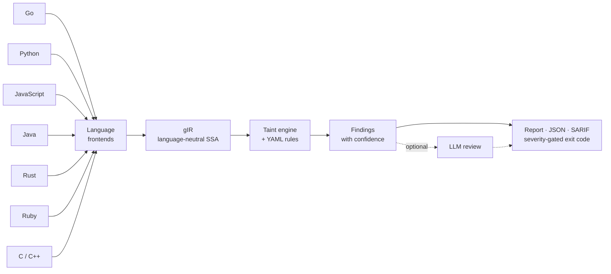
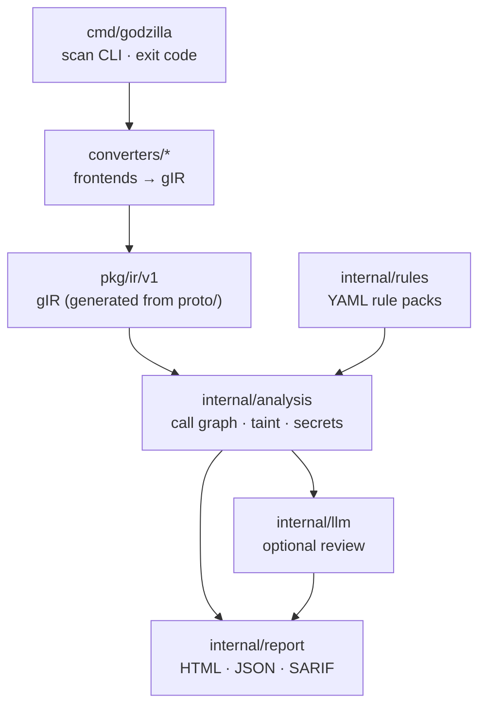

# Godzilla

[](https://github.com/bytevet/godzilla/actions/workflows/ci.yml)
[](https://github.com/bytevet/godzilla/actions/workflows/security.yml)
[](LICENSE)

**English** · [简体中文](docs/README.zh-CN.md)

A fast, multi-language **Static Application Security Testing (SAST)** analyzer for CI/CD gates.

Godzilla lowers many languages into one language-neutral SSA IR — **gIR** — and
runs a single inter-procedural taint engine over it. **Write a detection rule
once; it applies across every supported language.**


```mermaid
flowchart LR
    GO[Go] --> FE
    PY[Python] --> FE
    JS[JavaScript] --> FE
    JV[Java] --> FE
    RS[Rust] --> FE
    RB[Ruby] --> FE
    CC["C / C++"] --> FE

    FE["Language<br/>frontends"] --> IR["gIR<br/>language-neutral SSA"]
    IR --> ENG["Taint engine<br/>+ YAML rules"]
    ENG --> FD["Findings<br/>with confidence"]
    FD --> OUT["Report · JSON · SARIF<br/>severity-gated exit code"]
    FD -. optional .-> LLM["LLM review"]
    LLM -.-> OUT
```

> Status: usable and tested, but young. See [Status & limitations](#status--limitations).

## Features

- **Inter-procedural taint tracking.** Follows untrusted data across function
  calls (source → sanitizer → sink). Each finding carries a **confidence**: High
  intra-procedural, Medium cross-function.
- **YAML rules, sink-argument aware.** Sources / sinks / sanitizers / propagators
  are canonical-name globs. A sink can pin its injection-point argument
  (`"go:*database/sql*.Query#0"`), so a parameterized `db.Query("... = ?", x)` is
  **not** a false positive. See [docs/writing-rules.md](docs/writing-rules.md).
- **Batteries included.** Built-in packs for the classes in the
  [detection matrix](#supported-languages--detections), plus non-dataflow checks
  for **weak crypto** and **hardcoded secrets**.
- **CI-friendly output.** Human-readable findings, a single-file **HTML report**
  (filterable and sortable, with taint-flow snippets, syntax highlighting and a
  scan-diagnostics panel), **JSON** and **SARIF 2.1.0** (for GitHub code
  scanning), and a severity-gated **exit code**.
- **Optional LLM review.** A pluggable, off-by-default stage sends findings at or
  below **medium** confidence to Claude to trim false positives; High-confidence
  findings are never reviewed, and the stage fails open.
- **Single self-contained binary.** Go/JS parsing is pure Go; Python, Ruby, Java,
  and Rust shell out to a toolchain on `PATH` and degrade gracefully when absent.

## Install

```bash
go install github.com/bytevet/godzilla/cmd/godzilla@latest    # or, from a clone:
go build -o godzilla ./cmd/godzilla
```

Requires **Go 1.26.5+**. Scanning Python, Ruby, Java, or Rust also needs that
language's toolchain (`python3`, `ruby`, a JDK 24+ `java`, `rustc`) on `PATH`,
each degrading gracefully when absent. Or skip install and
[run with Docker](#run-with-docker).

Both commands above produce a binary that reports its version as `dev`. Use
`make build` for one stamped with the current tag (`godzilla version`).

## Quick start

```bash
# Scan a directory (or a single source file) with the built-in rules
godzilla scan ./path/to/project

# Write an HTML report and fail the build only on high+ severity
godzilla scan --html report.html --fail-on high ./path/to/project

# Machine-readable output: JSON for tooling, SARIF for GitHub code scanning
godzilla scan --sarif results.sarif --json results.json ./path/to/project

# Add your own rules on top of the built-ins
godzilla scan --rules myrules.yaml ./path/to/project

# Triage medium/low-confidence findings with an LLM (needs ANTHROPIC_API_KEY).
# A scan whose findings are all High reports "0 reviewed" — that is the gate
# working, not a failure.
godzilla scan --llm-review ./path/to/project

# Changed-files mode: gate only what a commit touched (one process, one gate)
git diff --name-only --cached | godzilla scan -files -
```

**Pre-commit hook** (`.git/hooks/pre-commit`) — gate a commit on only its staged
files, so a docs-only commit passes cleanly:

```bash
#!/bin/sh
git diff --name-only --cached --diff-filter=d | godzilla scan -files - --fail-on high
```

**Exit codes:** `0` clean · `1` error · `2` bad usage · `3` findings at/above
`--fail-on` (default: `medium`). Use the exit code as your CI gate.

```
$ godzilla scan ./test/go/sql_injection
coverage: go=ok

[high] go-sql-injection (CWE-89, confidence: medium)
  Untrusted input flows into a database/sql query without parameterized arguments...
  sink:   .../main.go:40:20  ->  go:(*database/sql.DB).QueryRow
  source: .../main.go:43:6
  in:     go:(*.../sql_injection.User).GetByID

[high] go-sql-injection (CWE-89, confidence: high)
  Untrusted input flows into a database/sql query without parameterized arguments...
  sink:   .../main.go:62:24  ->  go:(*database/sql.DB).Query
  source: .../main.go:58:27
  in:     go:.../sql_injection.main$1

2 finding(s); 2 at/above "medium"; 0 suppressed.
```

### Playground

A rule matches a **canonical name** and pins its injection point by **logical
argument index** (`go:*gorm*.DB*.Raw#0`); neither is visible in the source, and a
wrong `#<n>` fails silently — it selects a real argument, just not the intended
one ([docs/writing-rules.md](docs/writing-rules.md)). `godzilla-playground` is a
second binary that lowers a target once and serves a local web UI for exploring
the gIR and debugging rules against it; the scan pipeline is unchanged.

Three columns — file tree · source · gIR — with the source and gIR sides kept in
step, so clicking either highlights the other. Every call shows its canonical
name, and each argument's logical index is a badge you click to get the pattern;
a statically-resolved method call's receiver is drawn as `recv` and never
numbered, which is the off-by-one removed. A drawer at the bottom tests a
canonical pattern against the loaded module and reports how many calls it matches
and which argument each `#<n>` pins. Sink/source badges and the tester both run
through the real `internal/rules` matcher server-side, so the UI shows the
engine's own verdict rather than a second implementation of it. A file the walk
found but no frontend lowered is listed and flagged — such a file is invisible to
every rule.

```bash
go run ./cmd/godzilla-playground <path>          # or: godzilla-playground <path>

  -rules <path>         additional YAML rule file — or directory of rulepacks — to load alongside the built-in rules
  -addr <host:port>     listen address (default 127.0.0.1:0 — an ephemeral port)
  -open=false           do not open a browser
  -allow-build          allow running the scanned project's build tool (Maven/Gradle/Cargo)
  -parse-timeout <dur>  deadline per per-file parse/dump subprocess
  -build-timeout <dur>  deadline for a whole-project build under -allow-build
```

It binds loopback only and lowers once per invocation — no watching, no
re-lowering. `make build` and `go build ./...` build both binaries, and both
Docker images ship them ([Run with Docker](#run-with-docker)).

### Environment variables

Everything routine is a CLI flag (`godzilla scan -h`); the environment only
carries operator concerns:

| Variable | Effect |
|---|---|
| `GODZILLA_ALLOW_BUILD=1` | Same opt-in as `-allow-build`: lets a scan run the project's build tool (Maven/Gradle/Cargo). |
| `GODZILLA_RUSTC`, `GODZILLA_CARGO` | Paths to the Rust toolchain binaries (default: `rustc`, `cargo` on `PATH`). |
| `GODZILLA_CC`, `GODZILLA_CXX` | C/C++ compilers for the opt-in LLVM backend (default: `clang`, `clang++`). |
| `GODZILLA_LLM_MODEL` | Override the `-llm-review` model (default: `claude-haiku-4-5` for Anthropic, `gpt-4o-mini` for OpenAI). |
| `GODZILLA_LLM_PROVIDER=openai`, `GODZILLA_LLM_BASE_URL` | Select an OpenAI-compatible endpoint for `-llm-review` (e.g. a local model). |
| `ANTHROPIC_API_KEY` / `OPENAI_API_KEY` | Credentials for `-llm-review` (Anthropic also honors an `ant auth` profile). |
| `GOMEMLIMIT` | Respected as-is: setting it disables Godzilla's automatic soft memory limit. |

Subprocess deadlines are flags, not environment: `-parse-timeout` (default
`2m0s`, each per-file parse/dump) and `-build-timeout` (default `10m0s`, a
whole-project build under `-allow-build`).

## Run with Docker

Prebuilt images ship with the toolchains a scan needs, so you can gate a repo
without installing anything. They live on GHCR in two variants:

| Image | Size | Scans |
|---|---|---|
| `ghcr.io/bytevet/godzilla` (`:latest`) | ~600–700 MB | Go · JavaScript/TS · Python · Ruby · secrets |
| `ghcr.io/bytevet/godzilla:full` | ~1.5–2 GB | everything in slim **+ Java + Rust** |

The entrypoint is `godzilla` and the default command is `scan .`, so mounting a
repo at `/src` scans it immediately.

```bash
# Scan the current directory (exit 3 on a finding at/above --fail-on)
docker run --rm -v "$PWD:/src" ghcr.io/bytevet/godzilla

# Any arguments override the default `scan .`
docker run --rm -v "$PWD:/src" ghcr.io/bytevet/godzilla \
  scan --sarif /src/results.sarif --fail-on high /src

# Java/Rust need the full image
docker run --rm -v "$PWD:/src" ghcr.io/bytevet/godzilla:full

# The playground is the image's other binary. Bind 0.0.0.0 — the 127.0.0.1
# default is the container's own loopback, which no port publish reaches — and
# open it as localhost, since it serves loopback Host headers only.
docker run --rm -p 7391:7391 -v "$PWD:/src" \
  --entrypoint godzilla-playground ghcr.io/bytevet/godzilla \
  -addr 0.0.0.0:7391 -open=false /src
```

The slim image **skips** Java and Rust with a coverage warning rather than
failing. Tags: `X.Y.Z`/`X.Y`/`latest` (slim) and `X.Y.Z-full`/`full` (full) track
releases; `edge`/`edge-full` track `main`. Multi-arch (amd64 + arm64).

## Supported languages & detections

| | Go | Python | JavaScript | Java | Rust | Ruby |
|---|---|---|---|---|---|---|
| Parser | `golang.org/x/tools` SSA | `python3` `ast` | esbuild AST (pure Go); TS/JSX/ESM natively; Flow blanked in place; `.vue`/`.svelte` SFCs | JVM bytecode (`java.lang.classfile`) | rustc MIR | `ruby` Ripper; `.erb` templates |
| SQL injection | ✅ | ✅ | ✅ | ✅ | ✅ | ✅ |
| Command injection | ✅ | ✅ | ✅ | ✅ | ✅ | ✅ |
| Path traversal | ✅ | ✅ | ✅ | ✅ | ✅ | ✅ |
| SSRF | ✅ | ✅ | ✅ | ✅ | ✅ | ✅ |
| Reflected XSS | ✅ | ✅ | ✅ | ✅ | ✅ | ✅ |
| Open redirect | ✅ | ✅ | ✅ | ✅ | ✅ | ✅ |
| DOM XSS (client-side navigation) | — | — | ✅ | — | — | — |
| Insecure deserialization | — | ✅ | ✅ | ✅ | — | ✅ |
| Code injection (`eval`) | — | ✅ | ✅ | — | — | ✅ |
| Server-side template injection | — | ✅ | — | — | — | — |
| LDAP / XPath injection | — | ✅ | — | — | — | — |
| Zip slip | — | ✅ | — | — | — | — |
| Insecure framework config | — | ✅ | — | — | — | — |
| Weak crypto | ✅ | — | — | ✅ | — | — |

> **Hardcoded secrets** (CWE-798) are detected in **all** languages by
> `kind: secret` rules — regexps run over gIR string constants *and* over config
> files no frontend parses (`.env`, compose, CI YAML), independent of the taint
> engine. Add your own credential format with `--rules`.

- **JavaScript** also scans **Vue** (`.vue`) and **Svelte** (`.svelte`)
  single-file components: untrusted data reaching `v-html`/`:href` or `{@html}` is
  flagged as template-injection XSS (CWE-79). Pure Go, no Node.
- **JavaScript** also flags **client-side navigation** (`location.href = x`,
  `location.assign/replace`, `window.open`) as XSS, not just an open redirect. A
  server's `Location:` header is safe from this — browsers refuse to follow one to
  a `javascript:` URL — but assigning that same string to `location` in the page
  executes it, so encoding the value does not help and only a scheme allowlist does.
- **Ruby** also scans **ERB** templates (`.erb`), where a Rails view puts request
  input on the page. Rails auto-escapes `<%= %>`, so only the escape-bypassing
  forms — `<%== %>`, `raw`, `.html_safe` — are treated as XSS sinks.
- **Java** analyzes JVM **bytecode** (so it scans `.class`/`.jar` too); needs a
  JDK 24+ `java`. Maven/Gradle projects are built first so third-party deps are on
  the classpath.
- **Rust** analyzes **rustc MIR** and ships in the default binary; only `rustc` is
  needed. A `Cargo.toml` project is built so web-framework request accessors are
  recognized as sources.
- **C / C++** are analyzed via **LLVM IR** — an opt-in **cgo** build
  (`make build-llvm`, needs libLLVM + clang), *not* in the default binary. Adds
  command injection, path traversal, format string, SQL injection, and
  buffer-overflow checks.

Full frontend details are in [ARCHITECTURE.md](ARCHITECTURE.md).

## Writing rules

A rule is a source→sink taint spec (or a non-dataflow `dangerous-call` check)
matched against canonical `<lang>:module.Type.member` names. Adding a detection is
usually a few lines of YAML in [`rulepacks/`](rulepacks); pass your own with
`--rules`. See the **[rule-authoring guide](docs/writing-rules.md)**.

## Where the code lives


```mermaid
flowchart TD
    CLI["cmd/godzilla<br/>scan CLI · exit code"] --> CONV["converters/*<br/>frontends → gIR"]
    CONV --> IRp["pkg/ir/v1<br/>gIR (generated from proto/)"]
    IRp --> AN["internal/analysis<br/>call graph · taint · secrets"]
    RULES["internal/rules<br/>YAML rule packs"] --> AN
    AN --> REP["internal/report<br/>HTML · JSON · SARIF"]
    AN --> REV["internal/llm<br/>optional review"]
    REV --> REP
```

[ARCHITECTURE.md](ARCHITECTURE.md) has the design and the reasoning behind it.

## Status & limitations

Godzilla is functional and covered by tests, but deliberately scoped. Taint is
inter-procedural but **context-insensitive**, dynamic dispatch resolves by
class-hierarchy analysis, and pointer analysis is approximated (value-flow + CHA)
rather than a full points-to. Python, JS and Ruby build a real CFG, but
exceptions and `break`/`continue` stay approximate. SSRF findings are suppressed
only when the taint is confined to the path or query of a *proven* fixed host, so
the reduction never costs a true positive.

Details, and the per-component status table, are in
[ARCHITECTURE.md](ARCHITECTURE.md#implementation-status).

## Quality gate

`scripts/pr-quality-gate.sh` measures every PR against its base on four axes — LOC
changed (excluding tests), corpus TP/FP/FN, rule churn, and scan performance. CI
posts the report as a PR comment, and precision/recall/perf regressions block the
merge. Run it yourself with `scripts/pr-quality-gate.sh origin/main`. See
[docs/quality-gate.md](docs/quality-gate.md).

## Contributing

Contributions welcome — see [CONTRIBUTING.md](CONTRIBUTING.md). Good first areas:
new built-in rules (often just YAML — [guide](docs/writing-rules.md)), a new
language frontend, or better frontend fidelity.

Found a vulnerability **in Godzilla itself**? Please report it privately through
[GitHub's private vulnerability reporting](https://github.com/bytevet/godzilla/security/advisories/new)
rather than a public issue. A missed or false detection is not a vulnerability —
that is an ordinary issue, and a very welcome one.

## License

[MIT](LICENSE) © 2026 Byte.Vet
