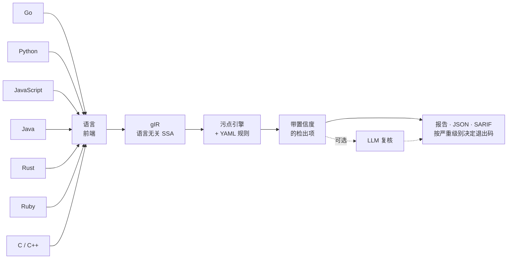
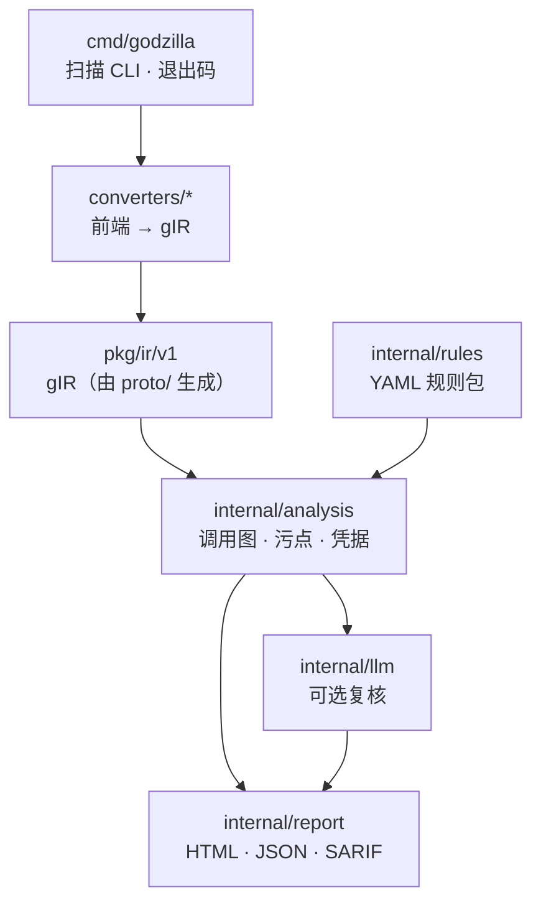

# Godzilla

[](https://github.com/bytevet/godzilla/actions/workflows/ci.yml)
[](https://github.com/bytevet/godzilla/actions/workflows/security.yml)
[](../LICENSE)

[English](../README.md) · **简体中文**

面向 CI/CD 门禁的高速多语言**静态应用安全测试（SAST）**分析器。

Godzilla 把多种语言统一转换为一套语言无关的 SSA 中间表示 **gIR**，再由同一个跨过程污点
分析引擎处理。**检测规则只需写一次，即可覆盖所有受支持的语言。**



> 状态：功能可用、有测试覆盖，但项目仍处于早期。参见[状态与局限](#状态与局限)。

## 特性

- **跨过程污点追踪。** 跨函数调用追踪不可信数据（污点源 source → 净化函数 sanitizer →
  汇点 sink）。每条检出项都带**置信度**：过程内为 High，跨函数为 Medium。
- **YAML 规则，可精确到汇点参数。** source、sink、sanitizer、propagator 一律用规范名
  （canonical name）通配符书写。汇点还能指定注入点参数
  （`"go:*database/sql*.Query#0"`），因此参数化的 `db.Query("... = ?", x)` **不会**被
  误报。详见 [docs/writing-rules.md](writing-rules.md)。
- **开箱即用。** 内置规则包覆盖[检测矩阵](#受支持的语言与检测能力)中的各类漏洞，另有两项
  非数据流检查：**弱加密**与**硬编码凭据**。
- **面向 CI 的输出。** 可读的检出列表、单文件 **HTML 报告**（可筛选、可排序，含污点传播
  路径片段、语法高亮与扫描诊断面板）、**JSON**、**SARIF 2.1.0**（对接 GitHub code
  scanning），以及按严重级别决定的**退出码**。
- **可选的 LLM 复核。** 一个可插拔、默认关闭的阶段，把置信度在 **medium** 及以下的检出项
  交给 Claude 复核以削减误报；High 置信度的检出项不送审，该阶段出错时一律放行。
- **单一自包含可执行文件。** Go 与 JS 的解析是纯 Go 实现；Python、Ruby、Java、Rust 会调用
  `PATH` 上的工具链，缺失时自动降级。

## 安装

```bash
go install github.com/bytevet/godzilla/cmd/godzilla@latest    # 或者，在克隆的仓库里：
go build -o godzilla ./cmd/godzilla
```

需要 **Go 1.26.5+**。扫描 Python、Ruby、Java、Rust 还需对应工具链（`python3`、`ruby`、
JDK 24+ 的 `java`、`rustc`）位于 `PATH` 上，缺失时会自动降级跳过。也可以不安装，直接
[用 Docker 运行](#用-docker-运行)。

以上两条命令产出的可执行文件，版本号都显示为 `dev`。想带上当前 tag 的版本号，请改用
`make build`，再用 `godzilla version` 查看。

## 快速上手

```bash
# 用内置规则扫描一个目录（或单个源文件）
godzilla scan ./path/to/project

# 生成 HTML 报告，并且只在 high 及以上严重级别时让构建失败
godzilla scan --html report.html --fail-on high ./path/to/project

# 机器可读输出：JSON 供工具消费，SARIF 供 GitHub code scanning
godzilla scan --sarif results.sarif --json results.json ./path/to/project

# 在内置规则之外追加自己的规则
godzilla scan --rules myrules.yaml ./path/to/project

# 用 LLM 复核 medium/low 置信度的检出项（需要 ANTHROPIC_API_KEY）。
# 若一次扫描的检出项全是 High，会显示 "0 reviewed"，这说明门槛在正常工作，并非故障。
godzilla scan --llm-review ./path/to/project

# 变更文件模式：只对本次提交改动的文件设门禁（单进程，统一门禁）
git diff --name-only --cached | godzilla scan -files -
```

**pre-commit 钩子**（`.git/hooks/pre-commit`）：只对暂存文件设门禁，纯文档提交因此可以
直接通过。

```bash
#!/bin/sh
git diff --name-only --cached --diff-filter=d | godzilla scan -files - --fail-on high
```

**退出码：** `0` 无问题 · `1` 出错 · `2` 用法有误 · `3` 存在达到或超过 `--fail-on`
（默认 `medium`）的检出项。直接把退出码用作 CI 门禁即可。

```
$ godzilla scan ./test/go/sql_injection
coverage: go=ok

[high] go-sql-injection (CWE-89, confidence: medium)
  Untrusted input flows into a database/sql query without parameterized arguments...
  sink:   .../main.go:40:20  ->  go:(*database/sql.DB).QueryRow
  source: .../main.go:43:6
  in:     go:(*.../sql_injection.User).GetByID

[high] go-sql-injection (CWE-89, confidence: high)
  Untrusted input flows into a database/sql query without parameterized arguments...
  sink:   .../main.go:62:24  ->  go:(*database/sql.DB).Query
  source: .../main.go:58:27
  in:     go:.../sql_injection.main$1

2 finding(s); 2 at/above "medium"; 0 suppressed.
```

### 大型 Go 仓库

Go 前端会下降依赖的**函数体**，因此污点能够穿过库代码而不是在库调用处中断 —— 但大型
仓库的传递依赖闭包动辄数百万行，把它们全部加载进来，可能在分析真正开始之前就耗尽机器
内存。`-dep-budget` 用来限定有多少第三方 Go 源码会被提升为完整分析：

| 取值 | 作用 |
|---|---|
| `auto`（默认） | 根据进程可用的内存自动确定上限 —— 容器的 cgroup 限额同样算数，因此内存更小的 CI runner 会得到更小的上限。 |
| `off` | 不设上限：无论代价多大，都加载整个依赖闭包。 |
| 字节数 —— `32M`、`256M` | 就用这个上限（后缀 `K`/`M`/`G`，按 1024 进制）。 |

预算优先花在离你自己的代码最近的依赖上，因此被舍弃的是闭包的外缘部分。它们只按**签名**
分析 —— 与标准库一直以来的处理方式相同。扫描仍会完整跑完、仍会报出检出；丢失的只是那些
本应**穿过**这些依赖函数体传递的污点。这类扫描被记为降级（degraded）而非失败：

```
coverage: go=DEGRADED
```

`-strict` 对它依然放行，因为前端确实跑完了 —— `-strict` 只在某个被识别出的语言完全没
有被分析时才失败。HTML 报告的扫描诊断面板会写明闭包中有多少被舍弃。

### Playground

规则匹配的是**规范名**，并以**逻辑参数下标**指定注入点（`go:*gorm*.DB*.Raw#0`）。这两者
在源码里都看不见，而 `#<n>` 写错时不会报错：它选中的确实是某个真实参数，只是并非你想要的
那个（参见 [docs/writing-rules.md](writing-rules.md)）。`godzilla-playground` 是第二个
可执行文件，它把目标转换一次，随后启动一个本地 Web 界面，用于查看 gIR 并在其上调试规则；
扫描流水线本身不受影响。

界面分三栏：文件树、源码、gIR。源码与 gIR 两侧保持联动，点击任一侧都会高亮另一侧。每个
调用都会显示自己的规范名，每个参数的逻辑下标以角标标出，点一下即可得到对应的模式串；静态
解析的方法调用，其接收者显示为 `recv` 且不参与编号，差一错误由此消除。底部面板可以把一条
规范名模式放到当前模块上试匹配，报告它命中了多少个调用，以及每个 `#<n>` 实际指向哪个参数。
汇点与污点源的标记、以及模式匹配本身，都在服务端走真正的 `internal/rules` 匹配逻辑，因此
界面呈现的是引擎自身的判断，而不是另一套实现。扫描时遍历到、却没有任何前端能够转换的文件，
会单独列出并标记：这类文件对所有规则都是不可见的。

```bash
go run ./cmd/godzilla-playground <path>          # 或者：godzilla-playground <path>

  -rules <path>         在内置规则之外追加的 YAML 规则文件或规则包目录
  -addr <host:port>     监听地址（默认 127.0.0.1:0，即由系统分配一个可用端口）
  -open=false           不自动打开浏览器
  -allow-build          允许运行被扫描项目的构建工具（Maven/Gradle/Cargo）
  -parse-timeout <dur>  单个文件解析/导出子进程的超时
  -build-timeout <dur>  `-allow-build` 下整项目构建的超时
```

它只监听本地回环地址，且每次启动只转换一次：不监听文件变化，也不会重新转换。`make build`
与 `go build ./...` 会同时构建这两个可执行文件，两个 Docker 镜像也都带上了它们
（见[用 Docker 运行](#用-docker-运行)）。

### 环境变量

日常配置都通过命令行参数完成（`godzilla scan -h`），环境变量只负责运维层面的设置：

| 变量 | 作用 |
|---|---|
| `GODZILLA_ALLOW_BUILD=1` | 与 `-allow-build` 等价的显式开关：允许扫描过程运行被扫描项目的构建工具（Maven/Gradle/Cargo）。 |
| `GODZILLA_RUSTC`、`GODZILLA_CARGO` | Rust 工具链的可执行文件路径（默认使用 `PATH` 上的 `rustc`、`cargo`）。 |
| `GODZILLA_CC`、`GODZILLA_CXX` | 可选 LLVM 后端使用的 C/C++ 编译器（默认 `clang`、`clang++`）。 |
| `GODZILLA_LLM_MODEL` | 覆盖 `-llm-review` 使用的模型（Anthropic 默认 `claude-haiku-4-5`，OpenAI 默认 `gpt-4o-mini`）。 |
| `GODZILLA_LLM_PROVIDER=openai`、`GODZILLA_LLM_BASE_URL` | 为 `-llm-review` 指定兼容 OpenAI 的接口（例如本地模型）。 |
| `ANTHROPIC_API_KEY` / `OPENAI_API_KEY` | `-llm-review` 的凭据（Anthropic 也支持 `ant auth` 配置）。 |
| `GOMEMLIMIT` | 原样尊重：一旦设置，Godzilla 就不再自动设定软内存上限。 |

子进程超时由命令行参数控制，而非环境变量：`-parse-timeout`（默认 `2m0s`，作用于单个文件
的解析/导出子进程）与 `-build-timeout`（默认 `10m0s`，作用于 `-allow-build` 下的整项目
构建）。

## 用 Docker 运行

预构建镜像已内置扫描所需的各语言工具链，无需在本机安装任何依赖即可为仓库设置门禁。镜像发布
在 GHCR 上，提供两个变体：

| 镜像 | 体积 | 可扫描 |
|---|---|---|
| `ghcr.io/bytevet/godzilla`（`:latest`） | 约 600–700 MB | Go · JavaScript/TS · Python · Ruby · 凭据 |
| `ghcr.io/bytevet/godzilla:full` | 约 1.5–2 GB | slim 的全部内容**外加 Java 与 Rust** |

入口点是 `godzilla`，默认命令为 `scan .`，因此把仓库挂载到 `/src` 就会立即开始扫描。

```bash
# 扫描当前目录（存在达到或超过 --fail-on 的检出项时退出码为 3）
docker run --rm -v "$PWD:/src" ghcr.io/bytevet/godzilla

# 传入任何参数都会覆盖默认的 `scan .`
docker run --rm -v "$PWD:/src" ghcr.io/bytevet/godzilla \
  scan --sarif /src/results.sarif --fail-on high /src

# Java/Rust 需要 full 镜像
docker run --rm -v "$PWD:/src" ghcr.io/bytevet/godzilla:full

# Playground 是镜像里的另一个可执行文件。要显式绑定 0.0.0.0：默认的 127.0.0.1 指的是
# 容器自身的回环地址，端口映射到不了；访问时也要用 localhost，因为它只接受回环 Host。
docker run --rm -p 7391:7391 -v "$PWD:/src" \
  --entrypoint godzilla-playground ghcr.io/bytevet/godzilla \
  -addr 0.0.0.0:7391 -open=false /src
```

slim 镜像遇到 Java 和 Rust 时会跳过并给出覆盖率警告，而不是直接失败。标签规则：
`X.Y.Z`/`X.Y`/`latest`（slim）与 `X.Y.Z-full`/`full`（full）跟随发布版本，
`edge`/`edge-full` 跟随 `main` 分支。支持 amd64 与 arm64 双架构。

## 受支持的语言与检测能力

| | Go | Python | JavaScript | Java | Rust | Ruby |
|---|---|---|---|---|---|---|
| 解析器 | `golang.org/x/tools` SSA | `python3` `ast` | esbuild AST（纯 Go）；原生支持 TS/JSX/ESM；Flow 语法就地抹除；支持 `.vue`/`.svelte` 单文件组件 | JVM 字节码（`java.lang.classfile`） | rustc MIR | `ruby` Ripper；支持 `.erb` 模板 |
| SQL 注入 | ✅ | ✅ | ✅ | ✅ | ✅ | ✅ |
| 命令注入 | ✅ | ✅ | ✅ | ✅ | ✅ | ✅ |
| 路径穿越 | ✅ | ✅ | ✅ | ✅ | ✅ | ✅ |
| SSRF | ✅ | ✅ | ✅ | ✅ | ✅ | ✅ |
| 反射型 XSS | ✅ | ✅ | ✅ | ✅ | ✅ | ✅ |
| 开放重定向 | ✅ | ✅ | ✅ | ✅ | ✅ | ✅ |
| DOM XSS（客户端跳转） | — | — | ✅ | — | — | — |
| 不安全的反序列化 | — | ✅ | ✅ | ✅ | — | ✅ |
| 代码注入（`eval`） | — | ✅ | ✅ | — | — | ✅ |
| 服务端模板注入 | — | ✅ | — | — | — | — |
| LDAP / XPath 注入 | — | ✅ | — | — | — | — |
| Zip slip | — | ✅ | — | — | — | — |
| 框架配置不安全 | — | ✅ | — | — | — | — |
| 弱加密 | ✅ | — | — | ✅ | — | — |

> **硬编码凭据**（CWE-798）由 `kind: secret` 规则在**所有**语言中检测：正则会作用于 gIR
> 中的字符串常量，*以及*任何前端都不解析的配置文件（`.env`、compose、CI YAML），与污点
> 引擎相互独立。你可以用 `--rules` 补充自己的凭据格式。

- **JavaScript** 还支持 **Vue**（`.vue`）与 **Svelte**（`.svelte`）单文件组件：不可信
  数据流入 `v-html`、`:href` 或 `{@html}` 会判定为模板注入型 XSS（CWE-79）。纯 Go 实现，
  不依赖 Node。
- **JavaScript** 还会把**客户端跳转**（`location.href = x`、`location.assign`/`replace`、
  `window.open`）判定为 XSS，而不仅仅是开放重定向。服务端的 `Location:` 响应头不受此影响
  —— 浏览器不会跟随跳转到 `javascript:` URL —— 但把同样的字符串赋值给页面里的 `location`
  会直接执行，因此对取值做编码没有用，只有校验协议白名单才有效。
- **Ruby** 还支持 **ERB** 模板（`.erb`），也就是 Rails 视图把请求数据渲染到页面的地方。
  Rails 会自动转义 `<%= %>`，因此只有绕过转义的写法（`<%== %>`、`raw`、`.html_safe`）
  才被视为 XSS 汇点。
- **Java** 分析的是 JVM **字节码**，因此 `.class` 与 `.jar` 同样可扫；需要 JDK 24+ 的
  `java`。Maven/Gradle 项目会先构建，以便第三方依赖出现在 classpath 上。
- **Rust** 分析的是 **rustc MIR**，包含在默认可执行文件中，只需 `rustc`。带
  `Cargo.toml` 的项目会先构建，以便把 Web 框架的请求访问器识别为污点源。
- **C / C++** 通过 **LLVM IR** 分析，属于可选的 **cgo** 构建（`make build-llvm`，需要
  libLLVM 与 clang），*不包含*在默认可执行文件中。它额外提供命令注入、路径穿越、格式化
  字符串、SQL 注入与缓冲区溢出检查。

各前端的完整细节见 [ARCHITECTURE.md](../ARCHITECTURE.md)。

## 编写规则

一条规则就是一份 source→sink 的污点声明（或一项非数据流的 `dangerous-call` 检查），按
规范名 `<lang>:module.Type.member` 匹配。新增一项检测通常只需在
[`rulepacks/`](../rulepacks) 里写几行 YAML；自定义规则用 `--rules` 传入。参见
**[规则编写指南](writing-rules.md)**。

## 代码结构



设计思路及其背后的取舍记录在 [ARCHITECTURE.md](../ARCHITECTURE.md)。

## 状态与局限

Godzilla 功能可用、有测试覆盖，但能力边界是刻意划定的。污点分析是跨过程的，但
**上下文不敏感**；动态分发通过类层次分析（CHA）解析；指针分析采用近似方案（值流 + CHA），
而非完整的指向分析。Python、JS 和 Ruby 会构建真实的控制流图，但异常与 `break`/`continue`
仍按近似处理。SSRF 的检出项只有在污点被限制在*已证明*固定的主机的 path 或 query 中时才会
被抑制，因此这项降噪不会牺牲真阳性。

更多细节以及逐组件的状态表，见
[ARCHITECTURE.md](../ARCHITECTURE.md#implementation-status)。

## 质量门禁

`scripts/pr-quality-gate.sh` 会从四个维度把每个 PR 与其基线对比：变更代码行数（不含
测试）、语料库上的 TP/FP/FN、规则改动量，以及扫描性能。CI 会把报告作为 PR 评论发出，
精确率、召回率或性能出现回退时会阻断合并。你也可以自己运行
`scripts/pr-quality-gate.sh origin/main`。参见 [docs/quality-gate.md](quality-gate.md)。

## 参与贡献

欢迎贡献，请先阅读 [CONTRIBUTING.md](../CONTRIBUTING.md)。适合入门的方向：新增内置规则
（通常只需写 YAML，参见[指南](writing-rules.md)）、新增一个语言前端，或提升现有前端的
转换保真度。

发现 **Godzilla 自身**的漏洞？请通过
[GitHub 私密漏洞报告](https://github.com/bytevet/godzilla/security/advisories/new)
私下反馈，不要提交公开 issue。漏报或误报不算漏洞，那是普通 issue，并且非常欢迎。

## 许可证

[MIT](../LICENSE) © 2026 Byte.Vet
