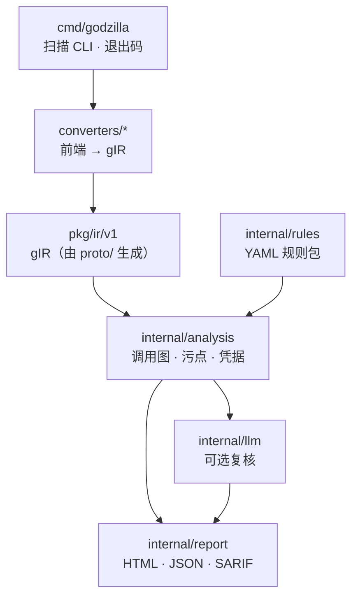

# Godzilla

[](https://github.com/bytevet/godzilla/actions/workflows/ci.yml)
[](https://github.com/bytevet/godzilla/actions/workflows/security.yml)
[](../LICENSE)

[English](../README.md) · **简体中文**

面向 CI/CD 门禁的高速多语言**静态应用安全测试（SAST）**分析器。

Godzilla 把多种语言下沉为同一套语言无关的 SSA 中间表示 —— **gIR** —— 再用单一的
跨过程污点引擎（taint engine）分析它。**检测规则只写一次，即对所有受支持的语言生效。**


> 状态：可用、有测试覆盖，但仍然年轻。参见[状态与局限](#状态与局限)。

## 特性

- **跨过程污点追踪。** 跨函数调用跟踪不可信数据（source → sanitizer → sink，即
  污点源 → 净化器 → 汇点）。每条检出都带**置信度**：过程内为 High，跨函数为 Medium。
- **YAML 规则，且理解汇点参数。** sources / sinks / sanitizers / propagators 都是
  规范名（canonical name）通配符。汇点可以钉住自己的注入点参数
  （`"go:*database/sql*.Query#0"`），因此参数化的 `db.Query("... = ?", x)` **不会**
  被误报。参见 [docs/writing-rules.md](writing-rules.md)。
- **开箱即用。** 内置规则包覆盖[检测矩阵](#受支持的语言与检测能力)中的各个类别，另有
  两项非数据流检查：**弱加密**与**硬编码凭据**。
- **适合 CI 的输出。** 人类可读的检出列表、单文件 **HTML 报告**（可筛选、可排序，带
  污点传播路径代码片段、语法高亮和扫描诊断面板）、**JSON** 与 **SARIF 2.1.0**（供
  GitHub code scanning 使用），以及按严重级别决定的**退出码**。
- **可选的 LLM 复核。** 一个可插拔、默认关闭的阶段，把置信度在 **medium** 及以下的
  检出交给 Claude 来削减误报；High 置信度的检出从不送审，且该阶段出错时放行
  （fail open）。
- **单一自包含二进制。** Go/JS 解析是纯 Go 实现；Python、Ruby、Java 和 Rust 会调用
  `PATH` 上的工具链，缺失时优雅降级。

## 安装

```bash
go install github.com/bytevet/godzilla/cmd/godzilla@latest    # 或者，从克隆的仓库：
go build -o godzilla ./cmd/godzilla
```

需要 **Go 1.26.5+**。扫描 Python、Ruby、Java 或 Rust 还需要对应语言的工具链
（`python3`、`ruby`、JDK 24+ 的 `java`、`rustc`）在 `PATH` 上，缺失时会优雅降级。
也可以跳过安装，直接[用 Docker 运行](#用-docker-运行)。

上面两条命令产出的二进制，其版本号都会显示为 `dev`。想要带上当前 tag 的版本号，请用
`make build`（随后用 `godzilla version` 查看）。

## 快速上手

```bash
# 用内置规则扫描一个目录（或单个源文件）
godzilla scan ./path/to/project

# 输出 HTML 报告，且仅在 high 及以上严重级别时让构建失败
godzilla scan --html report.html --fail-on high ./path/to/project

# 机器可读输出：JSON 供工具消费，SARIF 供 GitHub code scanning
godzilla scan --sarif results.sarif --json results.json ./path/to/project

# 在内置规则之上叠加自己的规则
godzilla scan --rules myrules.yaml ./path/to/project

# 用 LLM 复核 medium/low 置信度的检出（需要 ANTHROPIC_API_KEY）。
# 如果一次扫描的检出全是 High，会显示 "0 reviewed" —— 这是门槛在正常工作，
# 不是出了故障。
godzilla scan --llm-review ./path/to/project

# 变更文件模式：只对本次提交改动的文件设门禁（单进程，单一门禁）
git diff --name-only --cached | godzilla scan -files -
```

**pre-commit 钩子**（`.git/hooks/pre-commit`）—— 只对暂存的文件设门禁，这样纯文档
提交可以顺利通过：

```bash
#!/bin/sh
git diff --name-only --cached --diff-filter=d | godzilla scan -files - --fail-on high
```

**退出码：** `0` 干净 · `1` 出错 · `2` 用法错误 · `3` 存在达到或超过 `--fail-on`
（默认 `medium`）的检出。把退出码用作你的 CI 门禁。

```
$ godzilla scan ./test/go/sql_injection
coverage: go=ok

[high] go-sql-injection (CWE-89, confidence: medium)
  Untrusted input flows into a database/sql query without parameterized arguments...
  sink:   .../main.go:40:20  ->  go:(*database/sql.DB).QueryRow
  source: .../main.go:43:6
  in:     go:(*.../sql_injection.User).GetByID

[high] go-sql-injection (CWE-89, confidence: high)
  Untrusted input flows into a database/sql query without parameterized arguments...
  sink:   .../main.go:62:24  ->  go:(*database/sql.DB).Query
  source: .../main.go:58:27
  in:     go:.../sql_injection.main$1

2 finding(s); 2 at/above "medium"; 0 suppressed.
```

### 演练场

规则匹配的是**规范名**，并以**逻辑参数下标**钉住注入点（`go:*gorm*.DB*.Raw#0`）；这两者
在源码里都看不见，而写错的 `#<n>` 会静默失效 —— 它选中的确实是某个真实参数，只不过不是
你想要的那个（参见 [docs/writing-rules.md](writing-rules.md)）。`godzilla-playground` 是
第二个二进制：它把目标下沉一次，然后起一个本地 Web UI，用来浏览 gIR 并在其上调试规则；
扫描流水线本身不变。

界面分三栏 —— 文件树 · 源码 · gIR —— 源码侧与 gIR 侧保持同步，点其中一侧会高亮另一侧。
每个调用都会显示自己的规范名，每个参数的逻辑下标是一枚可点击的徽标，点一下就得到对应的
模式串；静态解析的方法调用，其接收者画作 `recv` 且从不参与编号，那个 off-by-one 就此
消失。底部的抽屉可以把一条规范名模式拿到已加载的模块上试匹配，报告它命中了多少个调用，
以及每个 `#<n>` 各自钉住的是哪个参数。汇点/污点源徽标与模式测试器都在服务端走真正的
`internal/rules` 匹配器，因此界面给出的是引擎自己的判断，而不是另一套实现。被目录遍历
发现、却没有任何前端下沉的文件会被单独列出并标记 —— 这样的文件对所有规则都是不可见的。

```bash
go run ./cmd/godzilla-playground <path>          # 或者：godzilla-playground <path>

  -rules <path>         额外加载的 YAML 规则文件 —— 或规则包目录 —— 与内置规则一同生效
  -addr <host:port>     监听地址（默认 127.0.0.1:0 —— 由系统分配的临时端口）
  -open=false           不要自动打开浏览器
  -allow-build          允许运行被扫项目的构建工具（Maven/Gradle/Cargo）
  -parse-timeout <dur>  每个文件的解析/导出子进程的超时
  -build-timeout <dur>  -allow-build 下整项目构建的超时
```

它只绑定本地回环地址，且每次启动只下沉一次 —— 不监听文件变化，也不会重新下沉。
`make build` 与 `go build ./...` 会同时构建这两个二进制。

### 环境变量

日常用的东西都是命令行参数（`godzilla scan -h`）；环境变量只承载运维层面的关注点：

| 变量 | 作用 |
|---|---|
| `GODZILLA_ALLOW_BUILD=1` | 与 `-allow-build` 等价的显式开关：允许扫描过程运行被扫项目的构建工具（Maven/Gradle/Cargo）。 |
| `GODZILLA_RUSTC`、`GODZILLA_CARGO` | Rust 工具链二进制的路径（默认使用 `PATH` 上的 `rustc`、`cargo`）。 |
| `GODZILLA_CC`、`GODZILLA_CXX` | 可选 LLVM 后端使用的 C/C++ 编译器（默认 `clang`、`clang++`）。 |
| `GODZILLA_LLM_MODEL` | 覆盖 `-llm-review` 使用的模型（Anthropic 默认 `claude-haiku-4-5`，OpenAI 默认 `gpt-4o-mini`）。 |
| `GODZILLA_LLM_PROVIDER=openai`、`GODZILLA_LLM_BASE_URL` | 为 `-llm-review` 选择兼容 OpenAI 的接口（例如本地模型）。 |
| `ANTHROPIC_API_KEY` / `OPENAI_API_KEY` | `-llm-review` 的凭据（Anthropic 也支持 `ant auth` 配置）。 |
| `GOMEMLIMIT` | 原样尊重：一旦设置，Godzilla 就不再自动设定软内存上限。 |

子进程超时是命令行参数而非环境变量：`-parse-timeout`（默认 `2m0s`，用于每个文件的
解析/导出子进程）与 `-build-timeout`（默认 `10m0s`，用于 `-allow-build` 下的整项目
构建）。

## 用 Docker 运行

预构建镜像自带扫描所需的各语言工具链，因此无需在本机安装任何东西即可为仓库设门禁。
镜像发布在 GHCR 上，分两个变体：

| 镜像 | 体积 | 可扫描 |
|---|---|---|
| `ghcr.io/bytevet/godzilla`（`:latest`） | 约 600–700 MB | Go · JavaScript/TS · Python · Ruby · 凭据 |
| `ghcr.io/bytevet/godzilla:full` | 约 1.5–2 GB | slim 的全部内容**外加 Java 与 Rust** |

入口点是 `godzilla`，默认命令是 `scan .`，因此把仓库挂载到 `/src` 就会立即开始扫描。

```bash
# 扫描当前目录（存在达到或超过 --fail-on 的检出时退出码为 3）
docker run --rm -v "$PWD:/src" ghcr.io/bytevet/godzilla

# 任何参数都会覆盖默认的 `scan .`
docker run --rm -v "$PWD:/src" ghcr.io/bytevet/godzilla \
  scan --sarif /src/results.sarif --fail-on high /src

# Java/Rust 需要 full 镜像
docker run --rm -v "$PWD:/src" ghcr.io/bytevet/godzilla:full
```

slim 镜像遇到 Java 和 Rust 时会**跳过**并给出覆盖率警告，而不是直接失败。标签规则：
`X.Y.Z`/`X.Y`/`latest`（slim）与 `X.Y.Z-full`/`full`（full）跟随发布版本；
`edge`/`edge-full` 跟随 `main`。多架构（amd64 + arm64）。

## 受支持的语言与检测能力

| | Go | Python | JavaScript | Java | Rust | Ruby |
|---|---|---|---|---|---|---|
| 解析器 | `golang.org/x/tools` SSA | `python3` `ast` | esbuild AST（纯 Go）；原生支持 TS/JSX/ESM；Flow 语法就地抹白；`.vue`/`.svelte` 单文件组件 | JVM 字节码（`java.lang.classfile`） | rustc MIR | `ruby` Ripper；`.erb` 模板 |
| SQL 注入 | ✅ | ✅ | ✅ | ✅ | ✅ | ✅ |
| 命令注入 | ✅ | ✅ | ✅ | ✅ | ✅ | ✅ |
| 路径穿越 | ✅ | ✅ | ✅ | ✅ | ✅ | ✅ |
| SSRF | ✅ | ✅ | ✅ | ✅ | ✅ | ✅ |
| 反射型 XSS | ✅ | ✅ | ✅ | ✅ | ✅ | ✅ |
| 开放重定向 | ✅ | ✅ | ✅ | ✅ | ✅ | ✅ |
| 不安全的反序列化 | — | ✅ | ✅ | ✅ | — | ✅ |
| 代码注入（`eval`） | — | ✅ | ✅ | — | — | ✅ |
| 服务端模板注入 | — | ✅ | — | — | — | — |
| LDAP / XPath 注入 | — | ✅ | — | — | — | — |
| Zip slip | — | ✅ | — | — | — | — |
| 框架配置不安全 | — | ✅ | — | — | — | — |
| 弱加密 | ✅ | — | — | ✅ | — | — |

> **硬编码凭据**（CWE-798）由 `kind: secret` 规则在**所有**语言中检测 —— 正则会跑在
> gIR 的字符串常量上，*以及*那些没有任何前端会解析的配置文件上（`.env`、compose、
> CI YAML），完全独立于污点引擎。用 `--rules` 可以加入你自己的凭据格式。

- **JavaScript** 还会扫描 **Vue**（`.vue`）和 **Svelte**（`.svelte`）单文件组件：
  不可信数据流入 `v-html`/`:href` 或 `{@html}` 会被判定为模板注入型 XSS（CWE-79）。
  纯 Go 实现，不依赖 Node。
- **Ruby** 还会扫描 **ERB** 模板（`.erb`）—— Rails 视图把请求输入放到页面上的地方。
  Rails 会自动转义 `<%= %>`，因此只有绕过转义的写法（`<%== %>`、`raw`、
  `.html_safe`）才被视作 XSS 汇点。
- **Java** 分析的是 JVM **字节码**（所以 `.class`/`.jar` 也能扫）；需要 JDK 24+ 的
  `java`。Maven/Gradle 项目会先构建，好让第三方依赖出现在 classpath 上。
- **Rust** 分析的是 **rustc MIR**，且包含在默认二进制里，只需要 `rustc`。带
  `Cargo.toml` 的项目会先构建，好让 Web 框架的请求访问器被识别为污点源。
- **C / C++** 通过 **LLVM IR** 分析 —— 这是一个可选的 **cgo** 构建
  （`make build-llvm`，需要 libLLVM + clang），*不在*默认二进制内。它额外提供命令
  注入、路径穿越、格式化字符串、SQL 注入和缓冲区溢出检查。

各前端的完整细节见 [ARCHITECTURE.md](../ARCHITECTURE.md)。

## 编写规则

一条规则就是一份 source→sink 的污点声明（或一个非数据流的 `dangerous-call` 检查），
匹配的是规范名 `<lang>:module.Type.member`。新增一项检测通常只是
[`rulepacks/`](../rulepacks) 里的几行 YAML；用 `--rules` 传入你自己的规则。参见
**[规则编写指南](writing-rules.md)**。

## 代码在哪里



设计本身以及背后的取舍写在 [ARCHITECTURE.md](../ARCHITECTURE.md) 里。

## 状态与局限

Godzilla 功能可用、有测试覆盖，但边界是刻意划定的。污点分析是跨过程的，但
**上下文不敏感**；动态分发通过类层次分析（CHA）解析；指针分析是近似的
（值流 + CHA），而非完整的 points-to。Python、JS 和 Ruby 会构建真实的控制流图，但
异常与 `break`/`continue` 仍是近似处理。SSRF 检出只有在污点被限制在一个*已证明*固定
的主机的 path 或 query 中时才会被抑制，因此这项降噪不会牺牲真阳性。

更多细节以及逐组件的状态表，见
[ARCHITECTURE.md](../ARCHITECTURE.md#implementation-status)。

## 质量门禁

`scripts/pr-quality-gate.sh` 会在四个维度上把每个 PR 与其基线作对比 —— 变更的代码行数
（不含测试）、语料库上的 TP/FP/FN、规则改动量，以及扫描性能。CI 会把报告作为 PR 评论
发出，精确率/召回率/性能的回退会阻断合并。你也可以自己运行
`scripts/pr-quality-gate.sh origin/main`。参见 [docs/quality-gate.md](quality-gate.md)。

## 参与贡献

欢迎贡献 —— 见 [CONTRIBUTING.md](../CONTRIBUTING.md)。适合上手的方向：新增内置规则
（往往只是 YAML —— [指南](writing-rules.md)）、新增一个语言前端，或提升现有前端的
保真度。

发现了 **Godzilla 本身**的漏洞？请通过
[GitHub 的私密漏洞报告](https://github.com/bytevet/godzilla/security/advisories/new)
私下反馈，而不是公开 issue。漏报或误报不算漏洞 —— 那是普通 issue，而且非常欢迎。

## 许可证

[MIT](../LICENSE) © 2026 Byte.Vet
